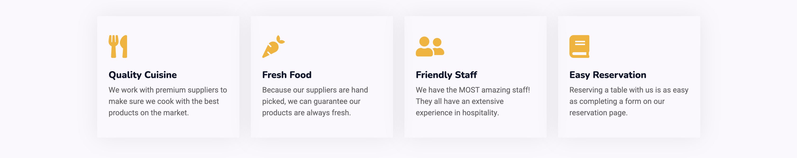
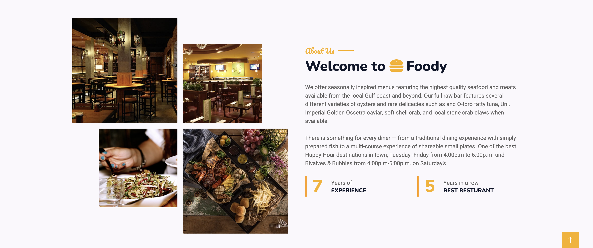
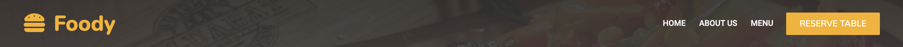
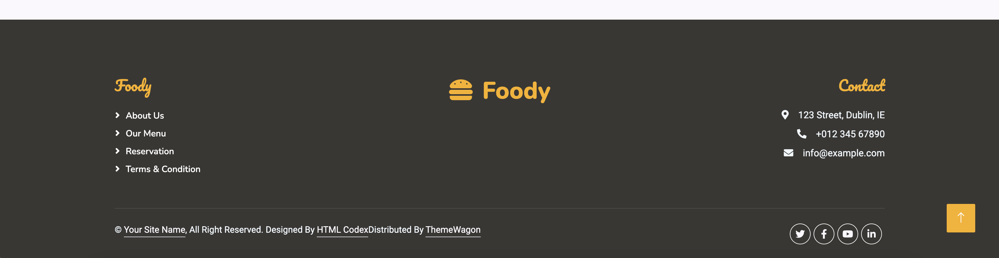

# Foody - Introduction

Project milestone 4 for Code Institute Full-stack development program.
Foody is a website for a restaurant where user can check the menu and make reservations, while the owner can check the reservation and update the menu according to the kitchen.

[Live Project Here]()

README Table Content

- [Tasty Blog - Introduction](#tasty-blog---introduction)
  - [User Experience - UX](#user-experience---ux)
    - [User Stories](#user-stories)
    - [The Scope](#the-scope)
  - [Design](#design)
    - [Wireframes](#wireframes)
  - [Database Diagram](#database-diagram)
  - [Features](#features)
    - [Home Page](#home-page)
    - [About Page](#about-page)
    - [Menu Page](#menu-page)
    - [Navbar](#navbar)
    - [Footer](#footer)
  - [Admin Panel/Superuser](#admin-panelsuperuser)
  - [Technologies Used](#technologies-used)
    - [Languages Used](#languages-used)
      - [Django Packages](#django-packages)
    - [Frameworks - Libraries - Programs Used](#frameworks---libraries---programs-used)
    - [Testing](#testing)
  - [Creating the Django app](#creating-the-django-app)
  - [Deployment of This Project](#deployment-of-this-project)
  - [Final Deployment](#final-deployment)
  - [Forking This Project](#forking-this-project)
  - [Cloning This Project](#cloning-this-project)
  - [Credits](#credits)
    - [Content](#content)
    - [Information Sources / Resources](#information-sources--resources)
  - [Special Thanks](#special-thanks)

## User Experience - UX

### User Stories

* As a website user, I can:

1. Navigate around the site and easily view the desired content.
2. View the menu the restaurant is offering before making a reservation.
3. Make a reservation online without the need of leaving the website.
4. Have contact information and 
5. Register for an account to avail of the services offered to members.
6. View the number of likes on a recipe thereby showing which is most popular.
7. View comments on recipes so that I can read other users opinions.

* As logged in website user, I can:

1. Like/unlike recipes marking the recipes I enjoyed.
2. Comment on recipes and give my opinion about the posts.
3. Delete my previous comments.
4. Manage my profile by updating my details and user image.
5. Share my favourites cookbooks by posting them on the Books Page.
6. Edit my favourite cookbook posted previously.
7. Delete my favourite cookbook posted previously.
8. Logout from the website.

* As a website superuser, I can:

1. Create and publish a new recipe.
2. Create draft recipe posts that can be reviewed and finalised later.
3. Create a new user, recipes, author and categories.
4. Delete user, recipes, author, categories and comments.
5. Approve user's comments.
6. Edit user's favourite cookbook that was posted previously.
7. Delete user's favourite cookbook that was posted previously.
8. Change the website permissions for a user.

### Agile Methodology

All functionality and development of this project were managed using GitHub which Projects can be found
[here](https://github.com/users/adrian-cucuet/projects/2/views/1)

### The Scope

#### Main Site Goals

* To provide users with a good experience and easy navigation.
* To provide users with a visually pleasing website that is intuitive to use and easy to navigate.
* To provide tools that allow users to see the menu and make a reservation.

## Design

#### Colours

 

* The colour scheme is kept simple by opting for a combination of white text set against the image
background and black text against the white background. For the navbar was set as a white background
colour that changes when the user scrolls. For a linear gradient, 3 colours were used dark
blue, orange and purple. This gradient is also used as a search box background. To highlight
the icons an interactive colour set of light blue was used.

#### Typography

* The Lato font is used as the main font for the whole project and the Kaushan font is used to
display the word enjoy in the Post Details and About pages.

#### Imagery

* All the imagery is related to the recipes and website design. Only 7 images are static.
The remaining imagery will be uploaded by the author to the database.
* For the purpose of the project all the images used are from template provided by [ThemeWagon](https://themewagon.com/)

### Wireframes

Wireframes for this project can be located [here](wireframes.md)

## Features

### Home Page

* The hero container is encouraging users to reserve a table with a CTA button 

* The service cards are encouraging the user to trust the business 

* There is an about us section followed by a team introduction so the user gain trust in the business 

### About Page

* The About Page gives, users information about Foody Restaurant. 

### Navbar

* The navigation bar is present at the top of every page and contains all links to the various other pages.
* The navigation bar has a reservation button to gove the user the option to book a table from any page.
* The navbar is fully responsive, collapsing into a hamburger menu when the screen size becomes smaller.

### Footer

* On the website footer, users can see basic information about the business such as contact, social media, 
  copyright, and the logo.

## Technologies Used

### Languages Used

* [HTML 5](https://en.wikipedia.org/wiki/HTML/)
* [CSS 3](https://en.wikipedia.org/wiki/CSS)
* [JavaScript](https://www.javascript.com/)
* [Django](https://www.python.org/)
* [Python](https://www.djangoproject.com/)

#### Django Packages

* [Gunicorn](https://gunicorn.org/) 
   As the server for Heroku
* [Cloudinary](https://cloudinary.com/) 
   Was used to host the static files and media
* [Dj_database_url](https://pypi.org/project/dj-database-url/) 
   To parse the database URL from the environment variables in Heroku
* [Psycopg2](https://pypi.org/project/psycopg2/) 
   As an adaptor for Python and PostgreSQL databases

### Frameworks - Libraries - Programs Used

* [Bootstrap](https://getbootstrap.com/) 
   Was used to style the website, add responsiveness and interactivity
* [Jquery](https://jquery.com/) 
   All the scripts were written using jquery library
* [Git](https://git-scm.com/) 
   Git was used for version control by utilizing the Gitpod terminal to commit to Git and push to GitHub
* [GitHub](https://github.com/) 
   GitHub is used to store the project's code after being pushed from Git
* [Heroku](https://id.heroku.com) 
   Heroku was used to deploy the live project
* [PostgreSQL](https://www.postgresql.org/) 
   Database used through heroku.
* [VSCode](https://code.visualstudio.com/) 
   VSCode was used to create and edit the website
* [PEP8](http://pep8online.com/) 
   PEP8 was used to validate all the Python code
* [W3C - HTML](https://validator.w3.org/) 
   W3C- HTML was used to validate all the HTML code
* [W3C - CSS](https://jigsaw.w3.org/css-validator/) 
   W3C - CSS was used to validate the CSS code
* [Fontawesome](https://fontawesome.com/) 
   To add icons to the website
* [Google Chrome Dev Tools](https://developer.chrome.com/docs/devtools/) 
   To check App responsiveness and debugging
* [Google Fonts](https://fonts.google.com/) 
   To add the 2 fonts that were used throughout the project

### Testing

Testing results [here](testing.md)

## Creating the Django app

1. Go to the Code Institute Gitpod Full Template [Template](https://github.com/Code-Institute-Org/gitpod-full-template)
2. Click on Use This Template
3. Once the template is available in your repository click on Gitpod
4. When the image for the template and the Gitpod are ready open a new terminal to start a new Django App
5. Install Django and gunicorn: `pip3 install django gunicorn`
6. Install supporting database libraries dj_database_url and psycopg2 library: `pip3 install dj_database_url psycopg2`
7. Create file for requirements: in the terminal window type `pip freeze --local > requirements.txt`
8. Create project: in the terminal window type django-admin startproject your_project_name
9. Create app: in the terminal window type python3 manage.py startapp your_app_name
10. Add app to the list of installed apps in settings.py file: you_app_name
11. Migrate changes: in the terminal window type python3 manage.py migrate
12. Run the server to test if the app is installed, in the terminal window type python3 manage.py runserver
13. If the app has been installed correctly the window will display The install worked successfully! Congratulations!

## Deployment of This Project

* This site was deployed by completing the following steps:

1. Log in to [Heroku](https://id.heroku.com) or create an account
2. On the main page click the button labelled New in the top right corner and from the drop-down menu select Create New
App
3. You must enter a unique app name
4. Next select your region
5. Click on the Create App button
6. Click in resources and select Heroku Postgres database
7. Click Reveal Config Vars and add a new record with SECRET_KEY
8. Click Reveal Config Vars and add a new record with the `CLOUDINARY_URL`
9. Click Reveal Config Vars and add a new record with the `DISABLE_COLLECTSTATIC = 1`
10. The next page is the project’s Deploy Tab. Click on the Settings Tab and scroll down to Config Vars
11. Next, scroll down to the Buildpack section click Add Buildpack select python and click Save Changes
12. Scroll to the top of the page and choose the Deploy tab
13. Select Github as the deployment method
14. Confirm you want to connect to GitHub
15. Search for the repository name and click the connect button
16. Scroll to the bottom of the deploy page and select the preferred deployment type
17. Click either Enable Automatic Deploys for automatic deployment when you push updates to Github

## Final Deployment 

1. Create a Procfile `web: gunicorn your_project_name.wsgi`
2. When development is complete change the debug setting to: `DEBUG = False` in settings.py
3. In this project the summernote editor was used so for this to work in Heroku add: `X_FRAME_OPTIONS = SAMEORIGIN `to
   settings.py.
4. In Heroku settings, delete the config vars for `DISABLE_COLLECTSTATIC = 1`

## Forking This Project

* Fork this project by following the steps:

1. Open [GitHub](https://github.com/PedroCristo/portfolio_project_4)
2. Find the 'Fork' button at the top right of the page
3. Once you click the button the fork will be in your repository

## Cloning This Project

* Clone this project by following the steps:

1. Open [GitHub](https://github.com/PedroCristo/portfolio_project_4)
2. You will be provided with three options to choose from, HTTPS, SSH or GitHub CLI, click the clipboard icon in order
to copy the URL
3. Once you click the button the fork will be in your repository
4. Open a new terminal
5. Change the current working directory to the location that you want the cloned directory
6. Type 'git clone' and paste the URL copied in step 3
7. Press 'Enter' and the project is cloned

## Credits

### Content

* Website Template

### Information Sources / Resources

* [W3Schools - Python](https://www.w3schools.com/python/)
* [Stack Overflow](https://stackoverflow.com/)

## Special Thanks

* Special thanks to 

